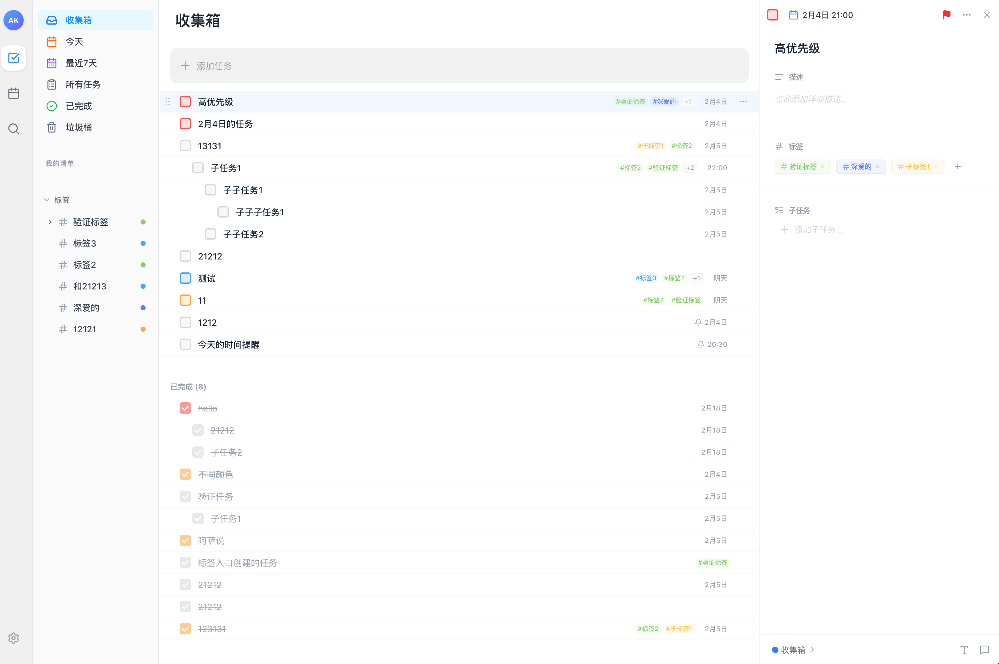

# 滴答清单克隆 (TickTick Clone)
一个使用 Tauri + React + TypeScript 开发的跨平台任务管理应用，模仿滴答清单的核心功能。

> [!IMPORTANT]
> **声明**：本项目仅供**自用和学习**交流使用，**严禁用于任何商业用途**。

## 🛡️ 数据与隐私

- **完全本地化**：当前版本所有任务数据均存储在您本地的 SQLite 数据库中，不会上传到任何服务器，确保您的隐私安全。
- **未来规划**：后续版本将计划引入**云端存储与同步**功能，届时将提供数据迁移方案。

## 界面预览




## ✨ 特性

- 🚀 **高性能**：基于 Tauri 框架，使用 Rust 后端，体积小、速度快
- 📱 **跨平台**：支持 macOS、Windows、Linux
- 🎨 **现代化 UI**：使用 Tailwind CSS，界面简洁美观
- 💾 **本地存储**：使用 SQLite 数据库，数据完全本地化
- ⚡ **实时响应**：React Query 数据管理，状态实时同步
- 🔒 **类型安全**：TypeScript + Rust 双重类型保障

## 🎯 核心功能

### 已实现
- ✅ 任务管理（创建、查看、编辑、完成、删除）
- ✅ 智能清单（所有任务、今天、最近7天、收集箱、已完成、垃圾桶）
- ✅ 任务分组（按过期、今天、更远、无日期、已完成自动分组）
- ✅ 子任务支持（多级嵌套、递归展示）
- ✅ 任务提醒（支持单次提醒设置）
- ✅ 重复任务（支持按天、周、月、年等周期性设置）
- ✅ 快捷键支持（全局与局部快捷键优化）
- ✅ 自定义清单与标签管理
- ✅ 任务优先级与截止日期
- ✅ 响应式三栏布局（侧边栏可折叠、面板宽度可拉伸）

### 计划中
- 🔄 任务搜索和高级过滤
- 🔄 深色模式支持
- 🔄 数据导入与导出
- 🔄 云端存储与多端同步功能
- 🔄 性能优化（大数据量虚拟滚动）

## 🛠️ 技术栈

### 后端
- **Tauri 2.10** - 跨平台应用框架
- **Rust 1.91** - 系统编程语言
- **SQLite** - 轻量级数据库
- **Tokio** - 异步运行时

### 前端
- **React 19** - UI 框架
- **TypeScript 5** - 类型安全
- **Tailwind CSS 4** - 样式框架
- **React Query** - 数据状态管理
- **Zustand** - 全局状态管理
- **date-fns** - 日期处理
- **lucide-react** - 图标库

## 📦 安装与下载

### 直接下载
您可以从 [GitHub Releases](https://github.com/<your-username>/dida-clone/releases) 页面下载最新的 macOS 编译版本（`.dmg` 或 `.app`）。

### 自动构建说明
本项目配置了 GitHub Actions 自动化构建流程。每当您向仓库推送以 `v` 开头的标签（例如 `v0.1.0`）时，GitHub 会自动触发构建任务并创建一个新的 Release 草稿。

**触发步骤：**
1. 修改 `package.json` 中的版本号。
2. 提交代码并推送标签：
   ```bash
   git tag v0.1.0
   git push origin v0.1.0
   ```
3. 前往 GitHub 仓库的 **Actions** 标签查看构建进度。
4. 构建完成后，在 **Releases** 页面发布生成的草稿。

### 本地开发前置要求
- Node.js 18+
- Rust 1.70+
- npm 或 yarn

### 克隆项目
```bash
git clone <repository-url>
cd dida-clone
```

### 安装依赖
```bash
npm install
```

## 🚀 运行

### 开发模式
```bash
npm run tauri dev
```

### 仅前端调试（浏览器本地存储模式）

在纯浏览器环境下（不通过 Tauri 容器），为了方便调试样式和交互，前端内置了一套 **浏览器本地存储的数据源**：

- 当检测到 **不是 Tauri 环境** 时，`taskService` 会自动将任务数据读写到 `localStorage`（key：`dida-tasks`）；
- 接口签名与 Tauri 模式完全一致，前端组件和 Hooks 无需任何改动；
- 适合用来在浏览器里调试列表展示、优先级颜色、复选框样式等纯前端逻辑。

推荐的调试方式：

```bash
# 方式一：使用 Tauri dev，自带前端 + 后端
npm run tauri dev
# 同时在浏览器直接打开 dev 地址（例如 http://localhost:1420）查看前端效果

# 方式二：只跑 Vite 前端（如果在项目中单独配置了 dev 脚本）
npm run dev
```

在浏览器中：

- 直接访问对应地址（如 `http://localhost:1420/` 或 Vite 端口），
- 添加 / 编辑 / 完成任务，这些数据会存储到 `localStorage`，刷新页面仍然存在，
- 可以方便地验证：
  - 不同优先级任务在列表中的展示效果；
  - 任务项复选框的颜色是否与优先级颜色保持一致；
  - 其他纯前端样式和交互行为。

### 构建生产版本
```bash
npm run tauri build
```

构建产物位于 `src-tauri/target/release/bundle/`

## 📁 项目结构

```
dida-clone/
├── src-tauri/              # Rust 后端
│   ├── src/
│   │   ├── commands/       # Tauri IPC 命令
│   │   │   ├── task.rs     # 任务相关命令
│   │   │   ├── list.rs     # 清单相关命令
│   │   │   └── tag.rs      # 标签相关命令
│   │   ├── db/             # 数据库层
│   │   │   ├── connection.rs   # 数据库连接
│   │   │   ├── task_repo.rs    # 任务仓储
│   │   │   ├── list_repo.rs    # 清单仓储
│   │   │   └── tag_repo.rs     # 标签仓储
│   │   ├── models/         # 数据模型
│   │   │   ├── task.rs     # 任务模型
│   │   │   ├── list.rs     # 清单模型
│   │   │   └── tag.rs      # 标签模型
│   │   ├── error.rs        # 错误处理
│   │   ├── state.rs        # 应用状态
│   │   └── lib.rs          # 库入口
│   └── Cargo.toml
│
├── src/                    # React 前端
│   ├── components/         # UI 组件
│   │   ├── Layout/         # 布局组件
│   │   │   ├── MainLayout.tsx
│   │   │   ├── Sidebar.tsx
│   │   │   └── Header.tsx
│   │   └── Task/           # 任务组件
│   │       ├── TaskList.tsx
│   │       ├── TaskItem.tsx
│   │       └── TaskDetail.tsx
│   ├── hooks/              # React Hooks
│   │   ├── useTasks.ts
│   │   └── useLists.ts
│   ├── services/           # API 服务层
│   │   ├── task.ts
│   │   ├── list.ts
│   │   └── tag.ts
│   ├── store/              # 状态管理
│   │   └── useAppStore.ts
│   ├── types/              # TypeScript 类型
│   │   ├── task.ts
│   │   ├── list.ts
│   │   └── tag.ts
│   ├── App.tsx
│   └── main.tsx
│
├── ARCHITECTURE.md         # 架构设计文档
├── TODO.md                 # 开发任务清单
└── README.md               # 本文件
```

## 🗄️ 数据库设计

应用使用 SQLite 数据库，包含以下表：

- **tasks** - 任务表
- **lists** - 清单表
- **tags** - 标签表
- **task_tags** - 任务标签关联表

数据库文件位于应用数据目录：
- macOS: `~/Library/Application Support/com.akm.dida-clone/dida.db`
- Windows: `%APPDATA%\com.akm.dida-clone\dida.db`
- Linux: `~/.local/share/com.akm.dida-clone/dida.db`

## 🎨 界面预览

应用采用三栏布局：
- **左侧边栏**：智能清单和自定义清单
- **中间区域**：任务列表
- **右侧面板**：任务详情

## 🤝 贡献

欢迎提交 Issue 和 Pull Request！

## 📄 许可证

MIT License

## 🙏 致谢

- [Tauri](https://tauri.app/) - 优秀的跨平台应用框架
- [滴答清单](https://dida365.com/) - 设计灵感来源

## 📮 联系方式

如有问题或建议，欢迎通过 Issue 联系。

---

**注意**：本项目仅用于学习和研究目的，不用于商业用途。
